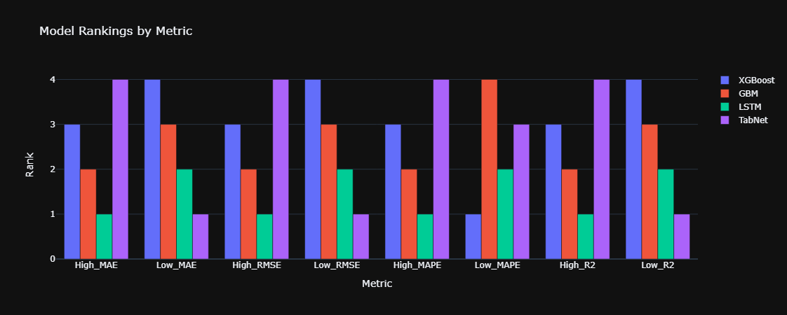

# BitAnalytica

## Overview

BitAnalytica is a comprehensive platform designed to analyze Bitcoin data using various technical indicators and machine learning models. The application provides hourly and daily insights into Bitcoin prices, leveraging sentiment analysis from news articles and multiple predictive models to forecast future price movements.

The application is deployed and can be accessed [here](https://bit-analytica.streamlit.app/).

## Project Structure

### Text Data Preprocessing

The text data preprocessing involves the following steps:
1. **Text Cleaning**: This involves converting the text to lowercase, removing URLs, mentions, hashtags, special characters, and numbers. It also includes tokenizing the text and lemmatizing the tokens while removing stop words.
2. **Sentiment Analysis**: Using a pre-trained BERT model (`finbert-tone`), the cleaned text is analyzed for sentiment.
3. **Sentiment Aggregation**: Sentiment values are aggregated based on predefined impact weights for different news categories.

### Bitcoin Data Preprocessing

The Bitcoin data preprocessing includes:
1. **Data Retrieval**: Historical Bitcoin price data is retrieved from Yahoo Finance using the `yfinance` library. The data starts from 2017 as it is the earliest year for which comprehensive news data is available.
2. **Technical Indicator Calculation**: Various technical indicators such as SMA, EMA, RSI, MACD, Bollinger Bands, ATR, Stochastic Oscillator, and OBV are calculated and added to the dataset.

### News Data Retrieval

The GDELT (Global Data on Events, Location, and Tone) public API was used to scrape news data related to Bitcoin. The GDELT API provides a rich set of data on global events, and we used it to gather Bitcoin-related news articles starting from 2017. This data was then used for sentiment analysis and aggregated to create a sentiment score for each day.

### Model Development and Evaluation

Several machine learning models were developed and evaluated to predict Bitcoin prices. The models include XGBoost, GBM, LSTM, and TabNet. The following metrics were recorded for each model:

| Metric      | XGBoost     | GBM         | LSTM        | TabNet      |
|-------------|-------------|-------------|-------------|-------------|
| High_MAE    | 1180.960636 | 988.406002  | 986.373626  | 1858.085311 |
| Low_MAE     | 1909.555146 | 1323.879481 | 1119.003943 | 695.863805  |
| High_RMSE   | 1738.781357 | 1527.839080 | 1380.796619 | 2633.704618 |
| Low_RMSE    | 2880.561402 | 1613.669497 | 1581.646053 | 972.651436  |
| High_MAPE   | 100.246164  | 100.203705  | 99.821382   | 101.364137  |
| Low_MAPE    | 98.053902   | 101.916627  | 98.872170   | 100.646099  |
| High_R2     | 0.989947    | 0.992238    | 0.993660    | 0.976936    |
| Low_R2      | 0.969617    | 0.990465    | 0.990840    | 0.996536    |

### Model Rankings by Metric

The models were ranked based on various metrics as shown in the following bar chart:



## Application Layout

The application is divided into three main sections:

### Bitcoin Hourly Data with Technical Indicators

This section provides a detailed hourly analysis of Bitcoin prices, including various technical indicators.

### Predictions

This section displays the predicted high and low prices of Bitcoin for the next interval. The predictions are updated every 24 hours.

### Bitcoin Technical Analysis Daily Chart

This section provides daily charts of Bitcoin prices with various technical indicators for the past 45 days.

## Notebooks

The project includes three notebooks:
1. **Text Data Preprocessing**: This notebook details the steps involved in cleaning and preprocessing text data for sentiment analysis.
2. **Bitcoin Data Preprocessing**: This notebook outlines the process of retrieving and processing Bitcoin data, including the calculation of technical indicators.
3. **Model Development and Evaluation**: This notebook covers the development, training, and evaluation of various machine learning models for predicting Bitcoin prices.

## Installation and Usage

To run the project locally, follow these steps:

1. Clone the repository:
    ```bash
    git clone https://github.com/yourusername/bit-analytica.git
    cd bit-analytica
    ```

2. Install the required packages:
    ```bash
    pip install -r requirements.txt
    ```

3. Run the Streamlit app:
    ```bash
    streamlit run app.py
    ```

## APIs Used

### GDELT API

The GDELT API was used to scrape news data related to Bitcoin. The API provides a comprehensive set of data on global events, which we filtered to get news articles related to Bitcoin. The data includes the title, publish date, URL, and full content of the articles.

### Yahoo Finance API

The Yahoo Finance API, accessed via the `yfinance` Python library, was used to retrieve historical Bitcoin price data. This data includes open, high, low, close prices, and volume information for each day. 

## Data Limitations

The data starts from 2017 because it is the earliest year for which comprehensive news data was available from the GDELT API. This limitation was due to the availability of historical news data.

## License

This project is licensed under the MIT License. See the [LICENSE](LICENSE) file for more details.

## Disclaimer

The information provided on this website is for informational purposes only and is not intended as financial advice. Always do your own research before making any investment decisions.

**Developed By Zeeshan Hameed**

## Acknowledgments

- **GDELT Project** for providing access to their comprehensive news data API.
- **Yahoo Finance** for the financial data API.
- **Hugging Face** for the `finbert-tone` model used in sentiment analysis.